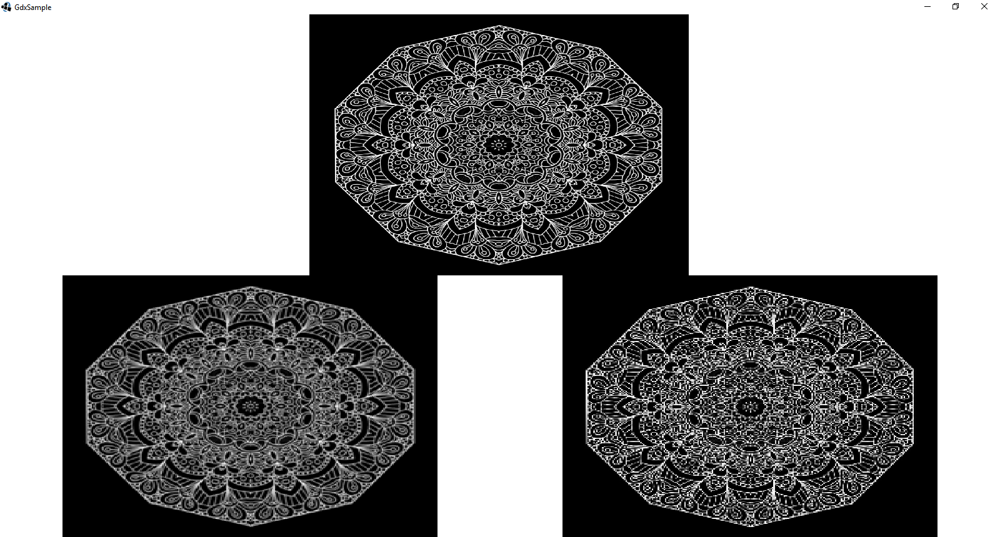

# gdx-pixmap-scaling-issue-sample
sample project showing issue with scaling pixmap

This project produces screen like this:

Upper image is full size source image. Lower left image is image scaled with GraphicsMagick with [following script](tools/resize.sh).
Lower right image is source image scaled with libGDX Pixmap methods.
